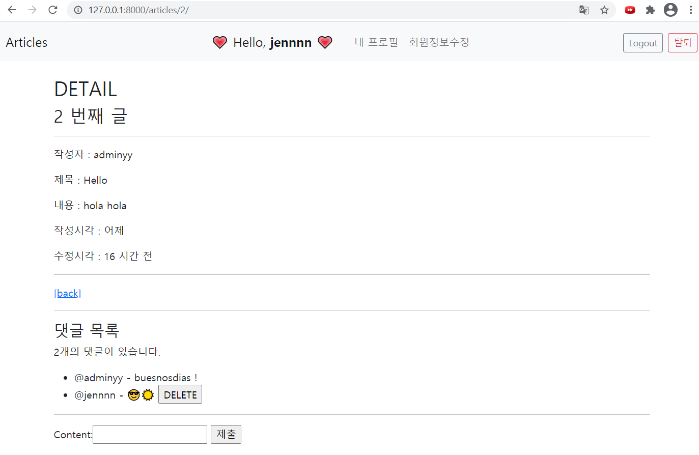

# Django 페이지 구현

CRUD와 model relationship을 중심으로 사이트 구현

 

 

### 주요 기능

- 게시글 조회, 작성, 수정, 삭제
- 댓글 조회, 작성, 삭제
- 사용자 회원가입, 로그인, 로그아웃, 회원정보 수정, 회원탈퇴
- 좋아요, 팔로잉 기능

 

### Model Relationship

Article-Comment : 1:N relationship

User-Article : 1:N relationship

User-Comment : 1:N relationship

User-User : M:N relationship

  

## 메인페이지

메인 페이지에서 작성된 글 목록을 보여줌

글 목록의 작성자를 누르면 개인 프로필 화면으로 감

좋아요 기능 구현

 

- 로그인 상태

로그인시 네비게이션 바에 사용자의 아이디, 프로필, 정보수정, 로그아웃, 탈퇴 버튼이 보이도록 구성

 

- 비로그인 상태

로그인과 회원가입 버튼만 보이도록 구성

  

## 상세정보 페이지

본인이 작성한 글만 수정 & 삭제 가능하도록 구현

본인이 작성한 댓글만 삭제할 수 있도록 구현

 

- 로그인 상태 - 본인이 작성한 글일 경우

 

- 로그인 상태 - 다른 사용자가 작성한 글일 경우

 

- 비로그인 상태

비로그인 상태에서는 글 작성 & 댓글 작성이 안되도록 설정

  

## 회원가입 페이지

django model form 사용하여 구성했다.

로그인, 회원 정보 수정, 비밀번호 변경 페이지 모두 동일한 폼 사용

 

올바르지 않은 데이터(ex.빈 칸)가 들어올 경우 제출이 되지 않는다.

  

## 프로필 페이지

url에 username을 프로필 주소로 설정했다.

 

- 다른 사람 프로필에서 팔로우 기능 구현

 

- 본인은 팔로우 할 수 없도록 설정함

