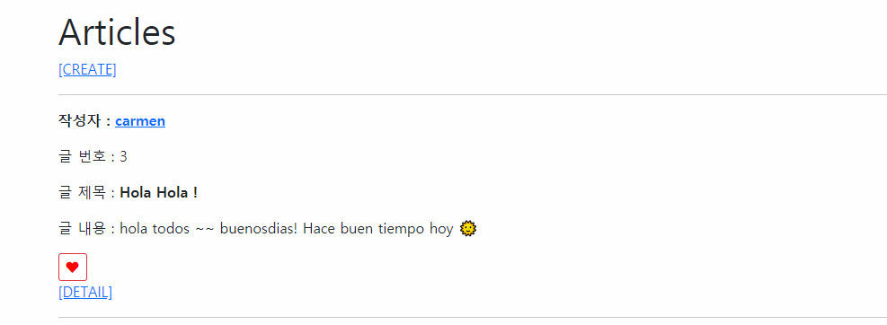

# 좋아요 버튼 아이콘으로 변경하기 

### 과정

https://fontawesome.com/ 사이트에서 로그인 후 Kits 탭에 들어가면 본인의 kit의 코드가 보인다.

이걸 가장 최상단의 기본이 되는 html 파일의 head 태그에 등록하면 된다.


- base.html

```django


<!DOCTYPE html>
<html lang="en">
<head>
  <meta charset="UTF-8">
  <meta http-equiv="X-UA-Compatible" content="IE=edge">
  <meta name="viewport" content="width=device-width, initial-scale=1.0">
  <script src="https://kit.fontawesome.com/{개인키}.js" crossorigin="anonymous"></script>
  
  <title>Document</title>
</head>
<body>
  
  <div class="container my-4">
    
    
  </div>
  
</body>
</html>
```

<br>

삽입하고 싶은 아이콘을 검색하여 들어가면, HTML에 넣을 코드가 보인다. 이걸 복붙해서 사용하면 된다.


<br>

- articles/index.html

좋아요를 누른 경우 빨간색 하트를 보여주고, 아직 좋아요를 누르지 않은 경우 검은색 하트를 보여주도록 설정했다.

```django
<div>
  <form action="" method="POST">
    
    
      <button class="btn btn-outline-danger btn-sm">
        <i class="fas fa-heart" style="color: red;"></i>  {# 이미 좋아요를 누른 상태이므로 빨간하트 #}
      </button>
    
      <button class="btn btn-outline-dark btn-sm">
        <i class="fas fa-heart" style="color: dark;"></i>  {# 아직 좋아요를 안 누른 상태이므로 검은하트 #}
      </button>
    
  </form>
</div>
```

<br>

### 결과 이미지

- 게시글 목록 페이지




<br>

- 상세페이지

좋아요를 누른 유저의 수도 함께 출력하였다.


<br>

---

<br>

# Gravatar 이용하여 소셜로그인하기

Gravatar 'API'는 인증이 필요하지 않다. HTTP GET 요청 하나로 모든 것을 처리하는 서비스이다.

https://ko.gravatar.com/site/check 에서 이메일을 등록하면 해시가 생성된다. 


이 해시를 이용해 소셜프로필 기능을 구현할 것이다. 

사용자가 회원가입 시 등록하는 이메일을 해시값으로 바꾸면 된다 !

<br>

### 과정

gravatar를 사용할 앱폴더에 `templatetags` 라는 폴더를 만든 후, 그 안에 `__init__.py`, `gravatar.py` 파일을 생성한다. 


https://ko.gravatar.com/site/implement/images/django/ 여기서 필요한 코드를 갖고 오면 된다.

- gravatar.py

```python
import hashlib
from django import template

 
register = template.Library()
 
 
@register.filter
def gravatar_url(email):
  return hashlib.md5(email.encode('utf-8').strip().lower()).hexdigest()
```

<br>

사용할 템플릿에 방금 만든 모듈명으로 load 한 후, img 태그를 이용해 등록하면 된다. 

https://ko.gravatar.com/site/implement/images/ 를 참고하여 url을 구성하자.

사용자의 프로필 사진이 비어있을 때 쿼리에 `d=` 를 사용하면 디폴트 값으로 보일 이미지를 설정할 수 있다.

- profile.html

```django



```

https://ko.gravatar.com/ 사이트에 접속하여 로그인하여 계정을 생성하고 프로필 이미지를 등록하면 최종적으로 반영된다 !

<br>

### 결과 이미지


