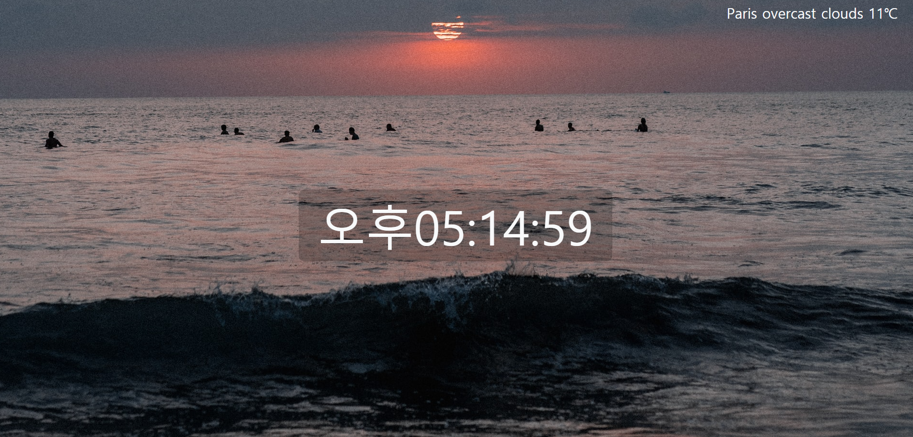

# JS로 실시간 시계 만들기


<br><br>

## 결과 이미지



<br>


<br>


<br>


<br>


<br>


<br>


<br>


<br><br>

## 과정


### 1️⃣ 랜덤으로 배경 이미지 불러오기

https://source.unsplash.com/ 사이트에서 고화질의 랜덤 이미지를 API로 받아와서 사용할 것이다.

1. 배경을 전체화면에 적용할 것이므로 body 태그에 스타일을 준다.

```css
    body {
      width: 100%;
      height: 100%;
			background-size: cover;
      background-position: center;
      margin: 0;
    }
```

2. Axios를 이용하여 get 방식으로 위 사이트에 요청을 보낸다.

- What is **Axios** ?
  - HTTP 통신에 편리한 Javascript 라이브러리
  - 브라우저, Node.js를 위한 Promise API를 활용하는 HTTP 비동기 통신 라이브러리
  - JSON 데이터로 자동변환이 가능하다.

3. 응답된 url을 `imageURL`이라는 변수에 할당한 후, body태그의 backgroundImage로 넣어준다.

```html
  <script src="https://unpkg.com/axios/dist/axios.min.js"></script>
  <script>
    axios.get(`https://source.unsplash.com/1920x1080/`)
    .then((response) => {
      const imageURL = response.request.responseURL
      document.body.style.backgroundImage = `url('${imageURL}')`
    })
  </script>
```

<br>


### 2️⃣ 시계 만들기

[MDN - Date](https://developer.mozilla.org/ko/docs/Web/JavaScript/Reference/Global_Objects/Date)의 공식문서를 참고해 함수를 구성해보자

1. `Date` 생성자는 시간의 특정 지점을 나타내는 `Date` 객체를 생성한다.

2. 시, 분, 초 등 구성하고 싶은 요소를 불러온 후, 시계가 위치할 HTML에 요소에 넣어준다.

   (나는 id가 time인 div태그를 만들어 거기에 넣어주었다.)

3. 시간이 계속 업데이트 될 수있도록  `setInterval` 함수를 사용해 1초마다 함수가 실행되도록 설정한다.

```html
<body>
    <div class="parent d-flex justify-content-center align-items-center text-center">
        <div id="time" class="text-light"></div>
    </div>
</body>

  <script>
    const dpTime = function () {
      const now = new Date()
      let hours = now.getHours()
      let minutes = now.getMinutes()
      let seconds = now.getSeconds()
      let ampm = ''
      if (hours > 12) {
        hours -= 12
        ampm = '오후'
      } else {
        ampm = '오전'
      }
      if (hours < 10) {
        hours = '0' + hours
      }
      if (minutes < 10) {
        minutes = '0' + minutes
      }
      if (seconds < 10) {
        seconds = '0' + seconds
      }
      document.querySelector('#time').innerHTML = ampm + hours + ":" + minutes + ":" + seconds
    }
    setInterval(dpTime, 1000)  // 1초마다 함수 실행되도록 설정
      
  </script>
</body>
```

<br>


### 3️⃣ 도시별 날씨 설정 하기

1. https://openweathermap.org/api 에서 API키를 발급한다.
2. Axios를 이용하여 get 방식으로 `https://api.openweathermap.org/data/2.5/weather?q=${city_name}&appid=${API_key}` 요청을 보내 필요한 정보를 가져오자
3. 필요한 정보를 가져온 후, 날씨 정보를 위치할 HTML에 요소에 할당한다.

```html
<body>
    <nav class="navbar justify-content-end fixed-top">
        <span id="weather" class="text-light"></span>
      </nav>
</body>

  <script>
    let weather = document.querySelector('#weather')
    let city_name = 'Seoul'
    const API_key = '개인키 넣기'
    axios.get(`https://api.openweathermap.org/data/2.5/weather?q=${city_name}&appid=${API_key}`)
    .then(function (response) {
      const weatherCity = response.data.name
      const weatherData = response.data.weather[0].description
      const temperature = (response.data.main.temp - 273.15).toFixed()
      weather.innerText = `${weatherCity}  ${weatherData}  ${temperature}℃`
    })
  </script>
```

<br>

4. 랜덤으로 도시 나오게 하기

- 뉴욕이 New York 만 인식되고, NY, newyork, new york, NewYork, ... 등등등 전부 인식이 안되어 홈페이지에 따로 명시된 리스트가 있는지 찾아봤는데 없었다. 그래서 그냥 리스트를 만들었다.
- `Math.random()` 함수를 이용하여 랜덤으로 `0~리스트길이` 범위의 난수를 생성해 배열의 인덱스로 넣어주었다.

- `randomCity` 라는 함수를 만들어 임의의 도시명을 리턴한 후, 그걸 url 정보에 담아 요청을 보내면 된다.

```js
    const city = ['Seoul', 'London', 'New York', 'Paris', 'Madrid', 'Tokyo', 'Los Angeles', 'Amsterdam', 'Sydney',]
    function randomCity(city) {
      return city[Math.floor(Math.random() * city.length)]
    }

    let city_name = randomCity(city)
```


- 새로고침을 할 때마다 배경이미지와 도시의 날씨가 바뀐다. (오른쪽 상단)


