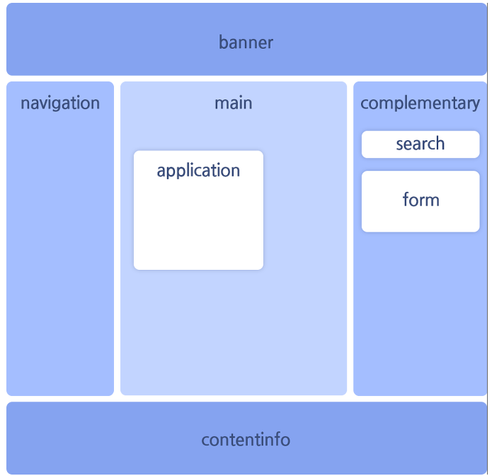

# WAI-ARIA 

>  [W3C](https://www.w3.org/)에 의해 제정된 **RIA(Rich Internet Applications)의 웹 접근성에 대한 표준 기술 규격**을 의미한다. 

## Role (역할)

> 유저 인터페이스(UI)에 포함된 특정 컴포넌트의 역할을 정의한다.
>
> **Abstract Roles / Widget Roles / Document Structure Roles / Landmark Roles**로 분류된다.

### 1. Abstract Roles

> Roles의 분류체계를 만들고 역활들을 정의하기 위한 Roles.
>
> WAI-ARIA를 구축하는 기반

### 2. Widget Roles

> 독립형 사용자 인터페이스를 동작시키기 위한 목적의 Roles.
>
> 더 큰 Roles에 포함되거나 복합 위젯의 일부로 사용되기도 한다.

| WAI-ARIA           | 의미                                                         |
| ----------------------------------- | ------------------------------------------------------------ |
| role="tablist"     | role="tab"과 함께 사용되는 복합형 Role속성이며 요소에 탭목록 역할을 부여한다. |
| role="tab"         | role="tablist"의 자식속성으로 사용되며 탭 역할을 부여한다.   |
| role="tabpanel"    | 탭의 본문 역할을 부여한다.                                   |
| aria-controls=""   | 현재 요소가 제어하는 대상을 명시하는 속성으로 탭메뉴와 본문을 연결시켜준다. 상태 값은 tabpanel의 id명 입력한다. |
| aria-selected=""   | 탭메뉴 선택 유무를 알려준다. 상태 값은 선택되었을 때 true / 선택되지 않았을 때 false 입력한다. |
| tabindex=""        | 키보드로 포커스를 받을 수 없는 요소일 때 포커스를 받을 수 있게 해준다. 상태 값은 포커스를 받지 않을 때 -1 / 포커스 받을 때 0 / 우선으로 포커스 받을 때 1 이다. |
| aria-labelledby="" | 레이블 제공을 위한 aria-속성. 상태 값은 연결시킬 레이블 id를 입력한다. |

### 3. Document Structure Roles

> 문서구조를 설명하는 목적의 Roles

| WAI-ARIA            | 의미                                                         |
| ------------------- | ------------------------------------------------------------ |
| role="tooltip"      | 초점을 받으면 노출되는 컨텐츠 혹은 참고용 컨텐츠의 역할을 부여한다. |
| aria-describedby="" | 현재 요소에 설명을 제공하는 속성. 속성 값은 참조(연결)시킬 요소의 ID값을 작성 |

### 4. Landmark Roles

> 웹 페이지의 각 영역을 명확하게 구분하는 목적의 Roles.
>
> 영역 역할을 지정할 수 있는 8개의 속성이 있다.

| WAI-ARIA             | 의미                                                         |
| -------------------- | ------------------------------------------------------------ |
| role="application"   | 동일한 역할의 요소 없음. 주로 `
` 요소와 같이 그룹 역할을 하는 요소로 대체할 수 있다. |
| role="banner"        | 동일한 역할의 요소 없음. 비슷한 의미로 `<header>` 요소를 사용할 수 있으나 `<header role="banner">`로 사용하였다 면 한 페이지에서 한 개의 `<header>` 요소만 사용하길 권장한다. |
| role="navigation"    | `<nav>` 요소. 다른 페이지 또는 페이지 내 특정 영역으로 이동하는 링크 콘텐츠 영역으로 주로 메인 메뉴 및 서브 메뉴 등에 사용할 수 있다. |
| role="main"          | `<main>` 요소. 본문의 주요 콘텐츠 영역으로 한 페이지 내에 1개만 사용이 가능하며, `<article>, <aside>, <footer>` 요소의 하위 요소로 사용할 수 없다. |
| role="complementary" | `<aside>` 요소. 주요 콘텐츠와 연관이 적은 의미있는 콘텐츠 영역으로 종종 사이드바로 표현할 수 있다. `<aside>` 영역에는 현재 날씨, 관련된 기사 또는 주식 정보등의 부가 콘텐츠를 포함 할 수 있다. |
| role="form"          | `<form>` 요소. 폼과 관련된 요소의 모임을 표현하는 영역으로 서버에 전송될 수 있는 콘텐츠를 포함 할 수 있다. |
| role="search"        | 동일한 역할의 요소 없음. 검색의 역할을 담당하는 서식 영역임을 의미하며 `
` 또는 `<form>` 요소를 사용하는 것을 권장한다. |
| role="contentinfo"   | 동일한 역할의 요소 없음. 비슷한 의미로 `<footer>` 요소를 사용할 수 있으나 `<footer role="contentinfo">`로 사용하였다면 한 페이지에서 한 개의 `<footer>` 요소만 사용하길 권장한다. |

## Property (속성) & State (상태)

>**Property (속성)** : 해당 컴포넌트의 특징이나 상황을 정의하며 속성명으로 "aria-*"라는 접두사를 사용한다.
>
>**State (상태)** :해당 컴포넌트의 상태 정보를 정의한다.
>
>Property (속성) & State (상태)는 **Widget states / Live Regions / Drag and Drop / Relationships** 로 분류된다.

### 1. Widget states

> 사용자가 데이터를 입력하여 송/수신하는 환경(자동완성, 체크여부 등)에서 사용하며 widget roles과 함께 사용된다.

| WAI-ARIA             | 의미                                                         |
| -------------------- | ------------------------------------------------------------ |
| role="combobox"      | 아래에 매뉴가 펼쳐지는 UI의 역할을 부여한다.                 |
| aria-expanded=""     | 펼쳐지거나 닫힐 수 있는 컨텐츠의 상태를 표시하는 aria-속성. 상태 값은 펼침 true / 닫힘 false |
| aria-labelledby=""   | 레이블 제공을 위한 aria-속성. 상태 값은 연결시킬 레이블 id를 입력한다. |
| aria-autocomplete="" | 사용자 입력에 대한 자동완성 지원 여부를 설정하는 aria-속성. 상태 값은 inline / list / both / none(default) |
| aria-owns=""         | 부모/자식 관계 형성하는 aria-속성. 상태 값은 자식으로 설정할 요소의 id값 (aria-controls와 관련) |
| aria-haspopup=""     | 팝업요소가 하위에 존재하고 있다는걸 인식 시켜주는 aria-속성.  상태 값은 false(default) / true / menu / listbox / tree / gird / dialog |

### 2. Live Regions

> 새로고침하지 않고도 컨텐츠 정보가 업데이트되는 환경에서 사용된다.

| WAI-ARIA     | 의미                                                         |
| ------------ | ------------------------------------------------------------ |
| role="alert" | 경고,알림 등의 컨텐츠 역할 부여                              |
| aria-live    | 페이지의 어떤 위치에 있든 업데이트된 정보를 사용자에게 알려주는 aria-속성. 상태 값은 assertive / off(default) / polite |

### 3. Drag and Drop

> 드래그 앤 드롭 기능 환경에서 사용된다.

| WAI-ARIA           | 의미                                                         |
| ------------------ | ------------------------------------------------------------ |
| role="listbox"     | role="option"과 함께쓰이는 복합형 Role 속성이며 선택가능한 옵션이 존재하는 리스트 역할을 부여한다. |
| role="option"      | role="listbox"와 함께 쓰이며 부모인 리스트의 옵션이라는 역할을 부여한다. |
| aria-dropeffect="" | 요소가 드롭되었을 때 사용자에게 알려준다. 상태값은 true / false |
| tabindex=""        | 키보드로 포커스를 받을 수 없는 요소일 때 포커스를 받을 수 있게 해준다.  상태 값은 포커스를 받지 않을 때 -1 / 포커스 받을 때 0 / 우선으로 포커스 받을 때 1 |

### 4. Relationships

> 요소 간의 관계 또는 연결을 나타내는 속성이다.

| WAI-ARIA           | 의미                                                         |
| ------------------ | ------------------------------------------------------------ |
| aria-labelledby="" | 레이블 제공을 위한 aria-속성. 상태 값은 연결시킬 레이블 id를 입력한다. |
| aria-controls=""   | 현재 요소가 제어하는 대상을 명시하는 속성으로 탭메뉴와 본문을 연결시켜준다. 상태 값은 tabpanel의 id명 입력 |
| aria-selected=""   | 탭메뉴 선택 유무를 알려준다. 상태 값은 선택되었을 때 true / 선택되지 않았을 때 false 입력 |
| tabindex=""        | 키보드로 포커스를 받을 수 없는 요소일 때 포커스를 받을 수 있게 해준다.  상태 값은 포커스를 받지 않을 때 -1 / 포커스 받을 때 0 / 우선으로 포커스 받을 때 1 |

 

- 출처 :  [맑은 커뮤니케이션 웹퍼블리싱 블로그](https://www.biew.co.kr/entry/WAI-ARIA-%EC%9B%B9%ED%8D%BC%EB%B8%94%EB%A6%AC%EC%8B%B1)

