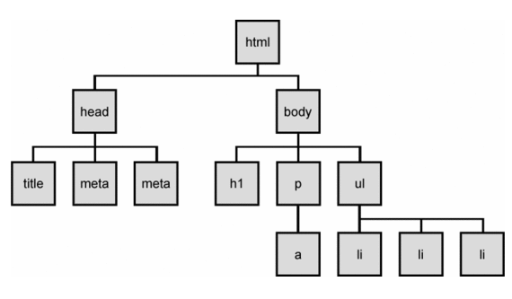
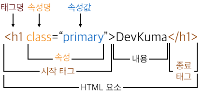
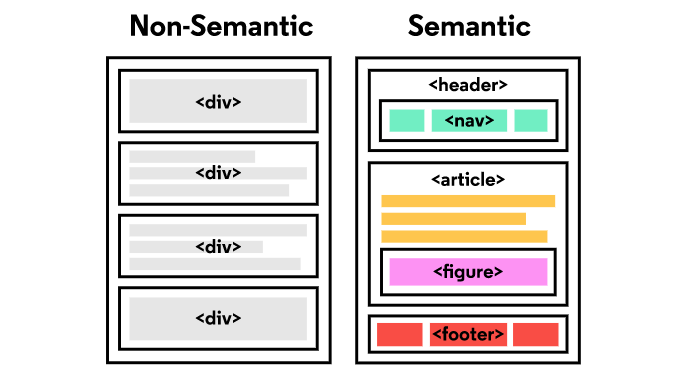
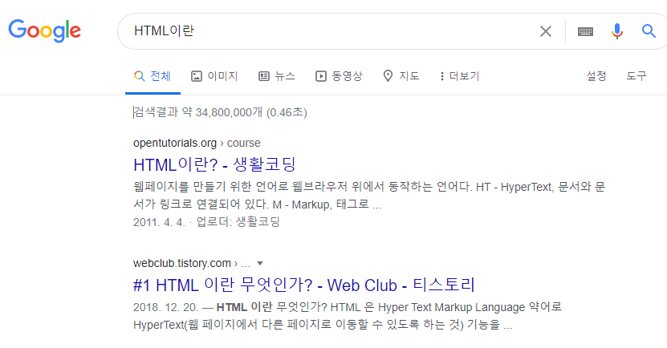

[TOC]

# HTML

> "웹 컨텐츠의 의미와 구조를 정의할 때 사용하는 언어"


<br>

## HTML 기초

**Hyper**

- 텍스트 등의 정보가 동일 선상에 있는 것이 아니라 다중으로 연결되어 있는 상태

**Hyper Text**

- 참조(하이퍼링크)를 통해 사용자가 한 문서에서 다른 문서로 즉시 접근 할 수 있는 텍스트
- 하이퍼 텍스트가 쓰인 기술등 중 가장 중요한 2가지 (http, html)

**Markup Language**

- 특정 텍스트에 역할을 부여하는, 따라서 "마크업을 한다" 라고 하는 건 제목이 제목이라하고 본문이 본문이라고 마킹을 하는 것
- ex) h1 tag는 단순히 글자가 커지는 것이 아니라 의미론적으로 그 페이지에서 가장 핵심 주제를 의미함.

<br>

## HTML 기본 구조

> head와 body로 나누어져 있음.
>
> - head : **화면에 안나옴!!** 문서 제목, 문자코드(인코딩)와 같이 해당 문서 정보를 담고 있음.
> - body : 브라우저 화면에 나타나는 정보로 실제 내용에 해당.

```html
<!DOCTYPE html>  <!-- 이 문서가 html이다 라고 처음에 명시하는거. 필수!  -->
<html lang="ko">
<head>
    <meta charset="utf-8">  <!-- "UTF-8" 대문자로 써도 되고 소문자로 써도 됨 -->
    <title>Hello, HTML</title>
</head>
<body>
    <h1>나의 첫번째 HTML</h1>
    <p>이것은 본문입니다.</p>
    <a href="https://www.naver.com">네이버로 이동!!</a>
</body>    
</html>
```

<br>

#### DOM(Document Object Model) 트리

> 태그들 끼리 부모와 자식 관계를 갖는거



- DOM은 문서의 구조화된 표현(structured representation)을 제공하며 프로그래밍 언어가 DOM 구조에 접근할 수 있는 방법을 제공하여 그들이 문서 구조, 스타일, 내용 등을 변경할 수 있게 도움
- DOM은 동일한 문서를 표현하고, 저장하고, 조작하는 방법을 제공
- 웹 페이지의 객체 지향 표현

<br>

#### 요소 (Element)

> HTML의 요소는 `태그+내용(contents)`으로 구성되어 있음. 요소는 중첩될 수 있고 여러 요소의 집합들로 이루어질 수도 있음.



- HTML 요소는 시작 태그와 종료 태그 그리고 태그 사이에 위치한 내용으로 구성
  - 태그(Element, 요소)는 컨텐츠(내용)를 감싸서 그 정보의 성격과 의미를 정의 한다.
- 내용이 없는 태그들
  - br, hr, img, input, link, meta
- 요소는 중첩(nested)될 수 있다.
  - 이러한 중첩들로 하나의 문서를 완성해 나간다.
  - 그리고 항상 열고 닫는 태그 쌍이 잘 맞는지 잘 봐야한다.
  - HTML은 오류를 뿜지 않고 그냥 레이아웃이 깨져버리기 때문에 어떤 면에서는 친절하게 오류 띄워주고 어디 틀렸는지 알려주는 프로그래밍 보다 디버깅이 힘들다.

<br>

#### 속성 (Attribute)

> `href` : a 태그가 갖고 있는 속성명. 
>
> 속성값은 공백 사용 안됨!! HTML에서는 쌍따옴표  사용.
>
> 태그별로 사용할 수 있는 속성은 다름.

- 속성(Attribute)은 태그의 부가적인 정보가 들어온다.
- 요소는 속성을 가질 수 있으며 요소에 추가적 정보(이미지 파일의 경로, 크기 등)를 제공한다. 
- 요소의 시작 태그에 위치해야 하며 **이름**과 **값**의 쌍을 이룬다.
- 태그와 상관없이 사용 가능한 속성들(html global attribute)도 있다.

<br>

## 시맨틱 태그

> 브라우저, 검색엔진, 개발자 모두에게 콘텐츠의 의미를 명확히 설명하는 태그




`<div>`랑 하는일 똑같음. 근데 왜 씀?!

**장점**

1. 읽기 쉬워진다. 코드의 가독성 good (개발자)
   
   - 개발자가 의도한 요소의 의미가 명확히 드러난다. -> 코드의 가독성을 높이고 유지보수를 쉽게 한다.
2. 접근성이 좋아진다. (검색엔진 및 보조기술 → 시력장애용 스크린리더 → 더 나은 경험 제공)
   - HTML 문서는 html 언어 + 사람이 읽을 수 있는 content의 조합인데, 검색 엔진은 HTML 코드만 잘 읽는다.
   
   - 그래서 이 검색 엔진이 HTML을 잘 이해하도록 시맨틱 태그 사용이 권장된다. 
   
     -> 검색 엔진도 무슨 내용인지 이해할 수 있게 되어 검색 엔진의 효율을 높일 수 있다.
   
     ​	ex. 구글에서 검색 시 대주제-소주제로 정리해서 사용자한테 제공하는 것.
   
     


**시맨틱 웹**

- 웹에 존재하는 수많은 웹페이지들에 메타데이터를 부여하여, 기존의 단순한 데이터 집합이었던 웹페이지를 '의미'와 '관련성'을 가지는 거대한 데이터베이스로 구축하고자 하는 발상.

---

## 참고 문헌

https://developer.mozilla.org/ko/docs/Learn/HTML/Introduction_to_HTML/Getting_started

https://developer.mozilla.org/ko/docs/Web/HTML/Global_attributes

https://developer.mozilla.org/ko/docs/Glossary/Semantics


- 사진 출처 : 구글